### 一、前提条件

1.存在docker
2.服务器可以联网（外网）
3.服务器内存至少4G（内存不够会出现502错误）

内存不足502错误如下图所示：


### 二、安装

安装环境:Centos7

1.查找GitLab镜像
```
docker search gitlab
```

2.拉取gitlab docker镜像
```
docker pull gitlab/gitlab-ce:latest
```

3.运行GitLab并运行容器
```
docker run \
-itd \
-p 9980:80 \
-p 9922:22 \
-v /usr/local/gitlab-test/etc:/etc/gitlab \
-v /usr/local/gitlab-test/log:/var/log/gitlab \
-v /usr/local/gitlab-test/opt:/var/opt/gitlab \
--restart always \
--privileged=true \
--name gitlab-test \
gitlab/gitlab-ce
```
成功会返回的容器ID哦！！
　　
命令解释：
```
-i 以交互模式运行容器，通常与 -t 同时使用命令解释：

-t 为容器重新分配一个伪输入终端，通常与 -i 同时使用

-d 后台运行容器，并返回容器ID

-p 9980:80 将容器内80端口映射至宿主机9980端口，这是访问gitlab的端口

-p 9922:22 将容器内22端口映射至宿主机9922端口，这是访问ssh的端口

-v /usr/local/gitlab-test/etc:/etc/gitlab 将容器/etc/gitlab目录挂载到宿主机/usr/local/gitlab-test/etc目录下，若宿主机内此目录不存在将会自动创建，其他两个挂载同这个一样

--restart always 容器自启动

--privileged=true 让容器获取宿主机root权限

--name gitlab-test 设置容器名称为gitlab-test

gitlab/gitlab-ce 镜像的名称，这里也可以写镜像ID
```

**重点：接下来的配置请在容器内进行修改，不要在挂载到宿主机的文件上进行修改。否则可能出现配置更新不到容器内，或者是不能即时更新到容器内，导致gitlab启动成功，但是无法访问**

4.进入容器内
```
docker exec -it gitlab-test /bin/bash
```

5.修改gitlab.rb

```
# 打开文件
vi /etc/gitlab/gitlab.rb
 
# 这个文件是全注释掉了的，所以直接在首行添加如下配置
  
# gitlab访问地址，可以写域名。如果端口不写的话默认为80端口 （图片上拼写错误，正确的是external_url）
external_url 'http://192.168.201.5:9980'
# ssh主机ip
gitlab_rails['gitlab_ssh_host'] = '192.168.201.5'
# ssh连接端口
gitlab_rails['gitlab_shell_ssh_port'] = 9922
```

6.修改gitlab.yml
```
# 打开文件
vi /opt/gitlab/embedded/service/gitlab-rails/config/gitlab.yml
```


```
# 配置解释：
 
# host：访问的IP  192.168.201.5
 
# port：访问的端口  9980
 
# 以上两个和gitlab.rb内external_url的配置保持一致
 
# ssh_host：ssh主机ip，和gitlab.rb内gitlab_rails['gitlab_ssh_host']保持一致


# 配置二：找到gitlab_shell标签下的ssh_port，将其修改为9922
#（和gitlab.rb内gitlab_rails['gitlab_shell_ssh_port'] 保持一致）
```


```
# 保存并退出:wq
```

7.让修改后的配置生效

```
gitlab-ctl reconfigure
```

8.重启gitlab

```
gitlab-ctl restart
```

9.退出容器

```
exit
```

10.在游览器输入如下地址，访问gitlab（eaxternal_url配置的就是这个）

```
http:192.168.201.5:9980
```

如果访问不成功的话：

（1）   进入容器查看gitlab.rb和gitlab.yml文件是否配置成功

（2）   查看防火墙是否开放9980、9922端口

11.依然访问不成功！！

确认防火墙firewall 和 iptables 都没有阻止端口。gitlab也运行成功，但是无法访问！！

查看端口,确实有监听9980和9922端口
```
netstat -lntp
```

但是telnet还是被拒绝
```
telnet 192.168.201.5 9980
```

查看了了日志，
```
$ docker logs -f -t  --tail=100 gitlab-test | grep "failed"

021/09/27 16:47:03 [crit] 929#0: *54 connect() to unix:/var/opt/gitlab/gitlab-workhorse/sockets/socket failed (2: No such file or directory) while connecting
to upstream, client: 127.0.0.1, server: 756dc32e9be4, request: "GET /help HTTP/1.1", upstream: "http://unix:/var/opt/gitlab/gitlab-work

实时查看gitlab的输出日志(也能找到上面错误)
gitlab-ctl tail

查看gitlab当前的启动状态(正常)
gitlab-ctl status
```

于是网上搜了方法,docker 镜像启动成功但是无法访问
```
解决办法：

vi /etc/sysctl.conf 或者

vi /usr/lib/sysctl.d/00-system.conf 添加如下代码： net.ipv4.ip_forward=1

重启network服务

systemctl restart network 查看是否修改成功

sysctl net.ipv4.ip_forward 如果返回为“net.ipv4.ip_forward = 1”则表示成功了
```
但因为原本就是"net.ipv4.ip_forward = 1"，所以也不是这个原因。

还提升了虚拟机内存，但同样无法访问。

最后，发现了gitlab对8080端口是有需求的，所以kill -9相关进程后，发现可以访问了(还是要等待一段时间)。


12.第一次访问默认是root账户，会需要修改密码（密码至少8位数，出现如下界面就基本上部署成功了）

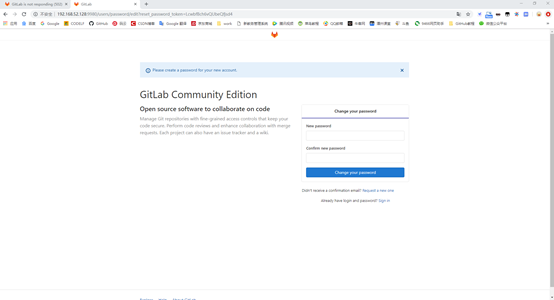


13.输入新密码后进行登录

```
root/gitlab123456
```

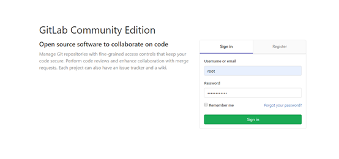

14.登录后界面如下图，创建一个新项目

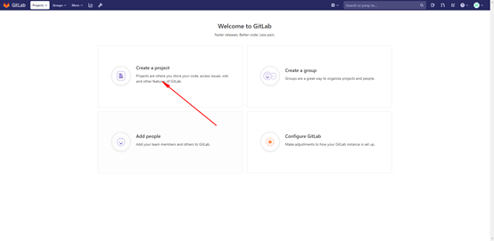


15.输入信息，创建项目

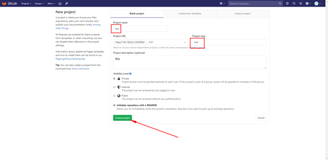

16.检查这里两处的ip的端口是否是你配置的

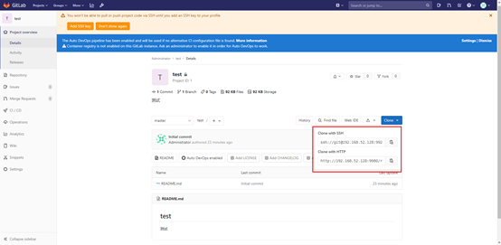


如果这里两处的端口和ip和配置的不一样，再次进入容器检查gitlab.yml文件

如下图显示：

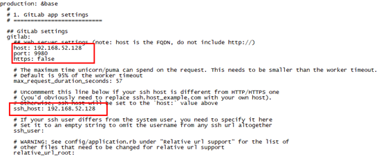

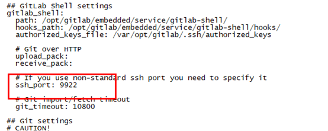

若不一样，将其修改为你的配置，然后:wq，再进行下面的操作

```
gitlab-ctl reconfigure
gitlab-ctl restart
```

17.安装到此结束


### 三、关闭用户注册

1.使用root用户登录gitlab

2.点击【Admin Area】

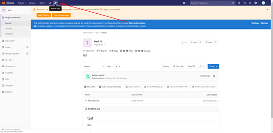

3.点击【Settings】

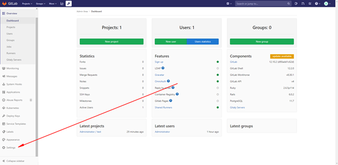

4.点击Sign-in restrictions这一栏的【Expand】

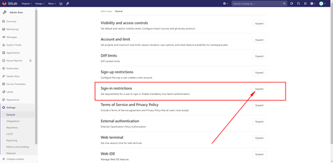

5.取消勾选

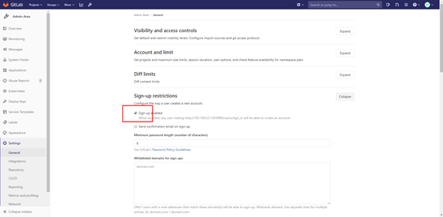

6.往下滑动，找到保存按钮，点击保存

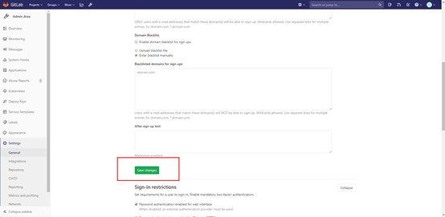

7.进入登录界面，发现注册的窗口已经消失了

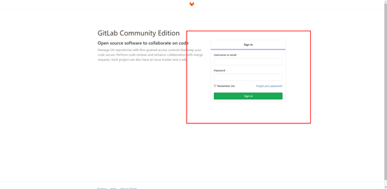

### 四、邮件配置

### 五、自动备份配置

### 原文链接

[docker部署gitlab](https://www.cnblogs.com/diaomina/p/12830449.html)

### 附录

虽然，这几篇文章没有真正帮助到点，但也给了启迪。让我关掉已占用的8080端口，在此附上链接。

[docker安装配置gitlab详细过程](https://www.cnblogs.com/zuxing/articles/9329152.html)

[centos7 gitlab14搭建完成后，无法访问的问题处理（“error“:“badgateway: failed to receive response: dial unix /var/opt）](https://blog.csdn.net/xiayuandongcn/article/details/119871356) 这篇有帮助，但未实践成功。因为直接kill了8080端口占用进程。

[我所遇到的GitLab 502问题的解决](https://blog.csdn.net/wangxicoding/article/details/43738137)

比较实用的几篇

[docker启动,重启,关闭命令](https://www.cnblogs.com/kofsony/p/11103852.html)

[CentOS7安装iptables防火墙](https://www.cnblogs.com/kreo/p/4368811.html)

[docker 端口映射 及外部无法访问问题](https://www.cnblogs.com/zl1991/p/10531726.html)