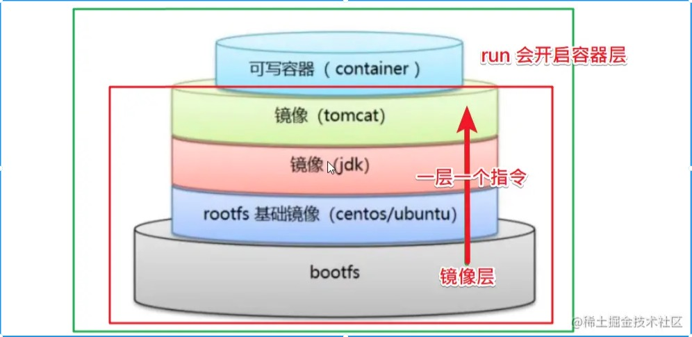

Dockerfile是Docker中用来**自动化构建**镜像的**配置文件**，在Dockerfile中，包含了构建镜像过程中需要执行的**命令、参数以及其他操作**，并且支持以`#`开头的注释行。

Dockerfile结构大致分为四部分：

- 基础镜像信息
- 维护者信息
- 镜像操作指令
- 镜像启动时执行的命令


### DockerFile构建过程

- docker从基础镜像**运行一个容器**
- 执行一条指令并**对容器做修改** 
- 执行类似docker commit的操作**提交一个新的镜像层**
- docker再**基于刚提交的镜像**运行一个新的容器
- 执行dockerfile中的下一条指令**直到**所有指令都**执行完成**

Dockerfile构建过程是以基础镜像为基础的，**每一条指令构建一层镜像**，因此每一条指令的内容，就是描述该层应当如何构建。以此，有了Dockerfile，我们可以方便的定制自己额外的需求，只需在Dockerfile里添加或者修改指令，重新构建即可。


## 构建步骤

- 编写一个 dockerfile 文件
- `docker build`构建成为一个镜像
- `docker run`运行镜像
- Docker push 发布镜像（DockerHub、阿里云像仓库）


## Dockerfile的编写规范

1. 每一个保留关键字(指令)都是必须是大写字母
2. 执行从上到下顺序执行
3. \#表示注释
4. 每一个指令都会创建提交一个新的镜像层，并提交



### Dockerfile常用指令

> FROM

FROM 指令用于**指定基础镜像**，其后构建新镜像以此为基础进行构建。`FROM`指令是Dockerfile文件中除注释命令之外的**第一条指令，也是必备的指令**。如果在同一个Dockerfile中**创建多个镜像**时，可以使用多个`FROM`指令（每个镜像一次）。

```
FROM <image>
# 或
FROM <image>:<tag>
# 或
FROM <image>:<digest>

FROM ubuntu:14.04
```

tag或digest是可选参数，如果不使用这两个值时，会使用latest版本的基础镜像。


> MAINTAINET

指定维护者的信息。


> RUN

**在镜像的构建过程中执行特定的命令**（执行某些动作、安装系统软件、配置系统信息之类），并生成一个中间镜像。

```
# shell格式
RUN <命令>
# exec格式
RUN ["可执行文件", "参数1", "参数2"]
```

**注意：**如果有多行命令尽量不要写多个`RUN`，因为Dockerfile中每一个指令都会构建一层，多少个`RUN`就构建了多少层镜像，会造成镜像的臃肿，还增加了构件部署的时间，可以使用换行符`\`。


> COPY

`COPY`命令用于将宿主机器上的的文件（Dockerfile所在目录的相对路径）复制到镜像内，如果目的位置不存在，Docker会自动创建。`源路径`所指定的源可以有多个,但必须是上下文根目录中的相对路径。

```
COPY <源路径>  <目标路径>
COPY ["<源路径1>",...   "<目标路径>"]
```

例如，把宿主机中的test.json文件复制到容器中/usr/src/app/目录下：

```
COPY test.json /usr/src/app/
```


> ADD

`ADD`指令的作用和`COPY`基本一致，但是在`COPY`基础上增加了一些功能，源路径可以是URL，也可以是 tar.gz。语法格式也和`COPY`一致。


> ENV

ENV指令可以为镜像创建出来的容器声明环境变量。并且在Dockerfile中，ENV指令声明的环境变量会被后面的特定指令(即ENV、ADD、COPY、WORKDIR、EXPOSE、VOLUME、USER)解释使用。

```
ENV <key> <value>
# 或
ENV <key1>=<value1> <key2>=<value2>...
```


> environment

compose file 中的 environment 节点用来为容器设置环境变量

```
web:
  environment:
    DEBUG: 1
 
等同于
$ docker run -e DEBUG=1
```

要把当前 shell 环境变量的值传递给容器的环境变量也很简单，去掉上面代码中的赋值部分就可以了：

```
web:
  environment:
    DEBUG:
```

这种情况下，如果没有在当前的 shell 中导出环境变量 DEBUG，compose file 中会把它解释为 null。

**使用文件为容器设置多个环境变量**

如果觉得通过 environment 为容器设置环境变量不够过瘾，我们还可以像 docker -run 的 --env-file 参数一样通过文件为容器设置环境变量。


> WORKDIR

格式: `WORKDIR /path/to/workdir`

WORKDIR指令**设置工作目录**，它之后的RUN、CMD、ENTRYPOINT、COPY以及ADD指令都会在这个工作目录下运行。如果这个工作目录不存在，则会自动创建一个。
WORKDIR指令可在Dockerfile中多次使用。如果提供了相对路径，则它将相对于上一个WORKDIR指令的路径。例如：

```
WORKDIR /a
WORKDIR b
WORKDIR c
RUN pwd
```

输出结果是 /a/b/c


>EXPOSE

为构建的镜像设置监听端口，使容器在运行时监听。

```
EXPOSE <port1> [<port2>...]

例如：
EXPOSE 8080

EXPOSE 8080其实等价于docker run -p 8080,如果需要把8081端口映射到宿主机中的某个端口（如8088）以便外界访问时，则可以用docker run -p 8088:8080
```


> USER

`USER`用于指定运行镜像所使用的用户。

```shell
USER root
```

使用`USER`指定用户后，Dockerfile中其后的命令`RUN`、`CMD`、`ENTRYPOINT`都将使用该用户执行。


> CMD

```
CMD ["可执行文件", "参数1", "参数2"]
```

**指定启动容器时执行的命令**，每个Dockerfile只能有一条`CMD`指令，如果指定了多条指令，则最后一条生效。

其作用是在启动容器的时候提供一个默认的命令项，如果用户执行`docker run`时提供了命令项，这个命令就会覆盖掉。


> VOLUME

```
VOLUME ["/data"]
```

创建一个可以从本地主机或其他容器挂载的挂载点，一般用来存放数据库和需要保持的数据等。


>ENTRYPOINT

**容器启动后执行的命令**，这些命令不能被`docker run`提供的参数覆盖。和`CMD`一样，每个Dockerfile中只能有一个`ENTRYPOINT`，如果指定了多条指令，则最后一条生效。 

```shell
ENTRYPOINT ["可执行文件", "参数1", "参数2"]
```


> ONBUILD

`ONBUILD`用于配置当前所创建的镜像作为其它新创建镜像的基础镜像时，所执行的操作指令。

```shell
ONBUILD [INSTRUCTION]
```


## DockerFile实例

> 编写Dockerfile

构建MySQL镜像

```
FROM ubuntu:bionic-20190612

LABEL maintainer xxxx@xxxx.com

ENV MYSQL_USER=mysql \
    MYSQL_VERSION=5.7 \
    MYSQL_DATA_DIR=/var/lib/mysql \
    MYSQL_RUN_DIR=/run/mysqld \
    MYSQL_LOG_DIR=/var/log/mysql

RUN apt-get update \
 && DEBIAN_FRONTEND=noninteractive apt-get install -y mysql-server=${MYSQL_VERSION}* \
 && rm -rf ${MYSQL_DATA_DIR} \
 && rm -rf /var/lib/apt/lists/*

EXPOSE 3306/tcp

CMD ["/usr/bin/mysqld_safe"]
```


>  运行构建命令构建

`docker build`命令用于使用Dockerfile创建镜像。
 **格式**

```shell
docker build [OPTIONS] PATH | URL | -
```

**常用OPTION如下：**：

- --build-arg=[]：设置镜像创建时的变量
- -f：指定要使用的Dockerfile路径
- -m：设置内存最大值
- --force-rm：设置镜像过程中删除中间容器
- --rm：设置镜像成功后删除中间容器
- --tag, -t：镜像的名字及标签，通常 name:tag 或者 name 格式


## 参考原文链接

[必会系列！使用Dockerfile构建镜像](https://juejin.cn/post/7018794120428650533)
[看完这篇,再也不用焦虑如何写dockerfile了](https://juejin.cn/post/6844904081966759943)
[Docker高级学习(二) Dockerfile](https://juejin.cn/post/7031450887725776904)