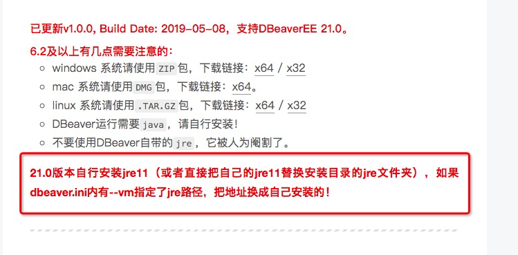

## 工具

* Redis Desktop Manager(被推荐，但未使用过)

* DBeaver(不仅支持redis，还支持多种数据库)

## 下载地址

[mac安装Redis可视化工具-Redis Desktop Manager](https://www.jianshu.com/p/214baa511f2e)

[DBeaver Enterprise 21.0 企业版激活方法](https://zhile.io/2019/05/08/dbeaver-license-crack.html)

## DBeaver配置



> Mac查询文件

mdfind -name 文件名字

> Mac查询文本

mdfind "John"
mdfind -onlyin ~/Library txt

> dbeaver.ini文件地址

/Applications/DBeaverEE.app/Contents/Eclipse/dbeaver.ini

> dbeaver.ini内容

```
-startup
../Eclipse/plugins/org.eclipse.equinox.launcher_1.6.0.v20200915-1508.jar
--launcher.library
../Eclipse/plugins/org.eclipse.equinox.launcher.cocoa.macosx.x86_64_1.2.0.v20200915-1442
-vm
/Library/Java/JavaVirtualMachines/openjdk-12.0.1.jdk/Contents/Home/bin/java
-vmargs
-XX:+IgnoreUnrecognizedVMOptions
--add-modules=ALL-SYSTEM
-Dosgi.requiredJavaVersion=11
-Xms128m
-Xmx2048m
-XstartOnFirstThread
-javaagent:/Applications/DBeaverEE.app/dbeaver-agent/dbeaver-agent.jar
```

> 使用方法:

 1. 在打开的dbeaver.ini编辑窗口末行添加(绝对路径)：
    "-vm"
    "-javaagent"
 2. 启动DBeaverEE即可。


