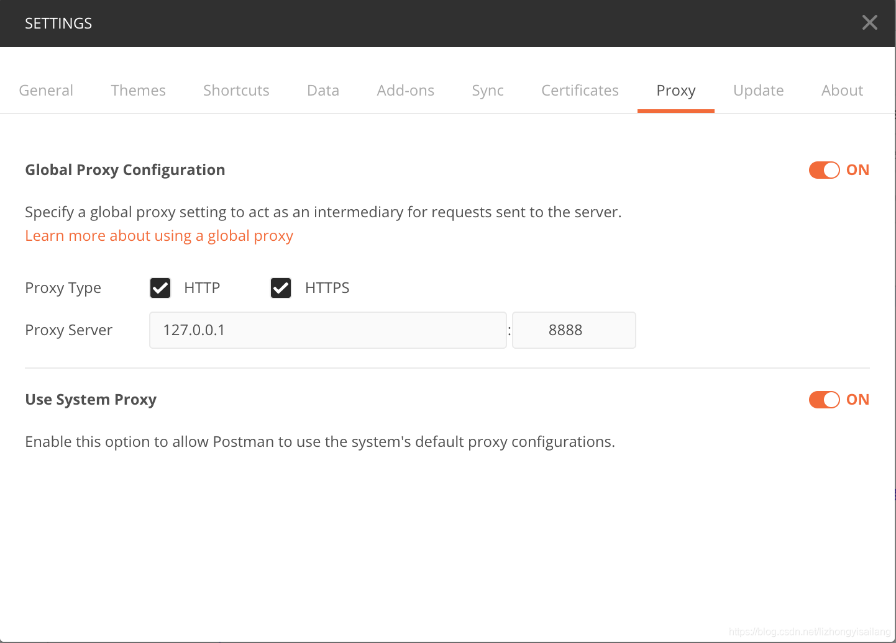

推荐一款自己常用的捕获手机端数据工具:**charles**

注意:关于安卓7.0版本以上charles无法抓取https包的问题,这个因为测试都是公司的包，所以安卓开发那边会做相应处理打包，就不会出现问题了。

[关于Charles的安装，Charles给手机链接代理，安装证书，安卓手机抓包的连接，以及配置](https://blog.csdn.net/lovelygirlyuzhu/article/details/109645152) 这篇文章写得很不错的。

> 常用的点

在处理好PC端的charles的下载，安装，证书之类后。

手机连接与电脑**同一网络下**的WIFI,手动设置`代理`，主机名`charles:Help->Local IP Addresses`,端口名`charles:Proxy->Proxy Settings->Port`。

连接成功后，其实就可以捕获数据了。但是https的数据会显示错误，这时候就需要下载证书了。

手机浏览器下载证书链接:http://chls.pro/ssl,下载完后。让手机信任证书，例如:"指纹与密码-其他安装选项-从存储装置安装"操作信任，当然不同手机操作信任的路径不一定相同。

> Charles抓包postman

因为有很多测试再`postman`上面测试，那么如何让`postman`上面的数据被charles捕获，看下面这篇文章。

[Charles抓包postman](https://blog.csdn.net/zhongyili_sohu/article/details/87881861)

要想postman请求走charles，那么需要手动在postman设置代理，如下图

> Charles Android 抓包失败(未实践，因为内部有专门可捕捉包)

[app抓不到包之将证书安装到系统证书中](https://blog.csdn.net/x2584179909/article/details/108376220)

[Charles Android 抓包失败SSLHandshake: Received fatal alert: certificate_unknown](https://blog.csdn.net/mrxiagc/article/details/75329629)