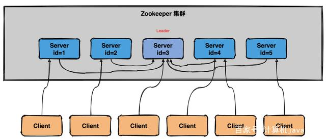
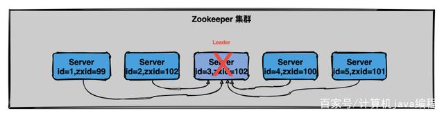
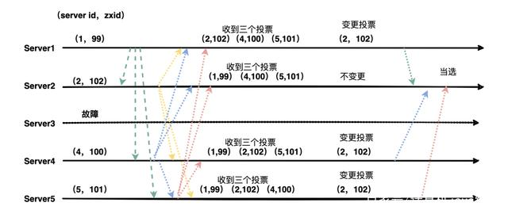

## 前言

Zookeeper 是一个分布式服务框架，主要是用来解决分布式应用中遇到的一些数据管理问题如：统一命名服务、状态同步服务、集群管理、分布式应用配置项的管理等。

## 选举

**注意如果 Zookeeper 是单机部署是不需要选举的，集群模式下才需要选举。**

>  选举四步骤：

* 个人能力

如何衡量 Zookeeper 节点个人能力？答案是靠**数据是否够新**，如果节点的**数据越新**就代表这个节点的个人能力**越强**，是不是感觉很奇怪，就是这么定的！

在 Zookeeper 中通常是以事务id（后面简称zxid）来标识数据的新旧程度（版本），节点最新的zxid越大代表这个节点的数据越新，也就代表这个节点能力越强。

zxid 的全称是 ZooKeeper Transaction Id，即 Zookeeper 事务id。

* 遇强改投

在集群选举开始时，节点首先认为自己是最强的（即数据是最新的），然后在选票上写上自己的名字（包括zxid和sid），zxid 是事务id，sid 唯一标识自己。

紧接着会将选票传递给其他节点，同时自己也会接收其他节点传过来的选票。每个节点接收到选票后会做比较，这个人是不是比我强（zxid比我大），如果比较强，那我就需要改票，明明别人比我强，我也不能厚着脸皮对吧。

* 投票箱

与人类选举投票箱稍微有点不一样，Zookeeper 集群会在每个节点的内存中维护一个投票箱。节点会将自己的选票以及其他节点的选票都放在这个投票箱中。由于选票是互相传阅的，所以最终每个节点投票箱中的选票会是一样的。

* 领导者

在投票的过程中会去统计是否有**超过一半**的选票选择同一个节点。一旦集群中有超过半数的节点都认为某个节点最强，那该节点就是领导者了，投票也宣告结束。

> **什么场景下 Zookeeper 需要选举？**

当 Zookeeper 集群中的一台服务器出现以下两种情况之一时，需要进入 Leader 选举。

（1）服务器初始化启动。

（2）服务器运行期间 Leader 故障。

> 启动时期的 Leader 选举

假设一个 Zookeeper 集群中有5台服务器，id从1到5编号，并且它们都是最新启动的，没有历史数据。

集群刚启动选举过程

假设服务器依次启动，我们来分析一下选举过程：

（1）服务器1启动

发起一次选举，服务器1投自己一票，此时服务器1票数一票，不够半数以上（3票），选举无法完成。

投票结果：服务器1为1票。

服务器1状态保持为LOOKING。

（2）服务器2启动

发起一次选举，服务器1和2分别投自己一票，此时服务器1发现服务器2的id比自己大，更改选票投给服务器2。

投票结果：服务器1为0票，服务器2为2票。

服务器1，2状态保持LOOKING

（3）服务器3启动

发起一次选举，服务器1、2、3先投自己一票，然后因为服务器3的id最大，两者更改选票投给为服务器3；

投票结果：服务器1为0票，服务器2为0票，服务器3为3票。此时服务器3的票数已经超过半数（3票），服务器3当选Leader。

服务器1，2更改状态为FOLLOWING，服务器3更改状态为LEADING。

（4）服务器4启动

发起一次选举，此时服务器1，2，3已经不是LOOKING 状态，不会更改选票信息。交换选票信息结果：服务器3为3票，服务器4为1票。此时服务器4服从多数，更改选票信息为服务器3。

服务器4并更改状态为FOLLOWING。

（5）服务器5启动

与服务器4一样投票给3，此时服务器3一共5票，服务器5为0票。服务器5并更改状态为FOLLOWING。

最终的结果：

服务器3是 Leader，状态为 LEADING；其余服务器是 Follower，状态为 FOLLOWING。
 
> 运行时期的Leader选举

在Zookeeper运行期间 Leader 和 非 Leader 各司其职，当有非 Leader 服务器宕机或加入不会影响 Leader，但是一旦 Leader 服务器挂了，那么整个 Zookeeper 集群将暂停对外服务，会触发新一轮的选举。

初始状态下服务器3当选为Leader，假设现在服务器3故障宕机了，此时每个服务器上zxid可能都不一样，server1为99，server2为102，server4为100，server5为101

集群 Leader 节点故障运行期选举与初始状态投票过程基本类似，大致可以分为以下几个步骤：

（1）状态变更。Leader 故障后，余下的非 Observer 服务器都会将自己的服务器状态变更为LOOKING，然后开始进入Leader选举过程。

（2）每个Server会发出投票。

（3）接收来自各个服务器的投票，如果其他服务器的数据比自己的新会改投票。

（4）处理和统计投票，每一轮投票结束后都会统计投票，超过半数即可当选。

（5）改变服务器的状态，宣布当选。

运行器 Leader 故障后选举流程

（1）第一次投票，每台机器都会将票投给自己。

（2）接着每台机器都会将自己的投票发给其他机器，如果发现其他机器的zxid比自己大，那么就需要改投票重新投一次。比如server1 收到了三张票，发现server2的xzid为102，pk一下发现自己输了，后面果断改投票选server2为老大。

> 选举机制中涉及到的核心概念

敲黑板了，这些概念是面试必考的。

（1）Server id（或sid）：服务器ID

比如有三台服务器，编号分别是1,2,3。编号越大在选择算法中的权重越大，比如初始化启动时就是根据服务器ID进行比较。

（2）Zxid：事务ID

服务器中存放的数据的事务ID，值越大说明数据越新，在选举算法中数据越新权重越大。

（3）Epoch：逻辑时钟

也叫投票的次数，同一轮投票过程中的逻辑时钟值是相同的，每投完一次票这个数据就会增加。

（4）Server状态：选举状态

LOOKING，竞选状态。

FOLLOWING，随从状态，同步leader状态，参与投票。

OBSERVING，观察状态,同步leader状态，不参与投票。

LEADING，领导者状态。

> 总结

（1）Zookeeper 选举会发生在服务器初始状态和运行状态下。

（2）初始状态下会根据服务器sid的编号对比，编号越大权值越大，投票过半数即可选出Leader。

（3）Leader 故障会触发新一轮选举，zxid 代表数据越新，权值也就越大。

（4）在运行期选举还可能会遇到脑裂的情况，大家可以自行学习。

## 具体可以看下面原文章:

[**用大白话给你解释Zookeeper的选举机制**](https://baijiahao.baidu.com/s?id=1685254558927619982&wfr=spider&for=pc)