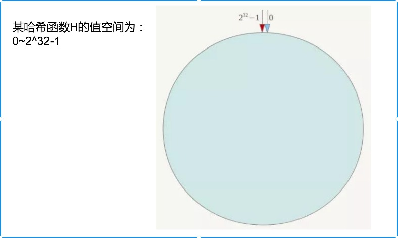
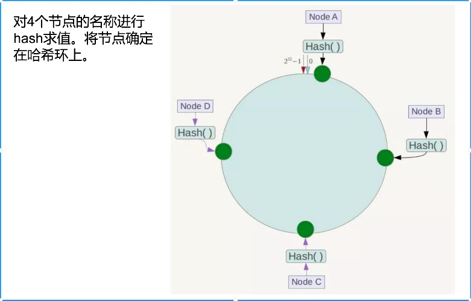
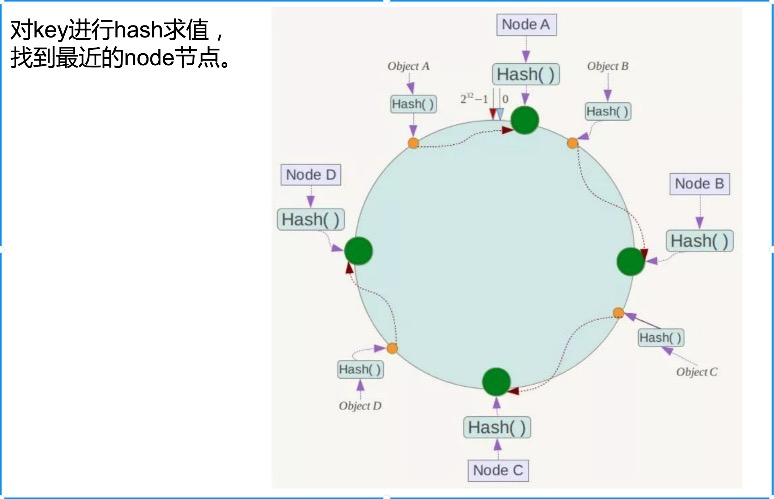
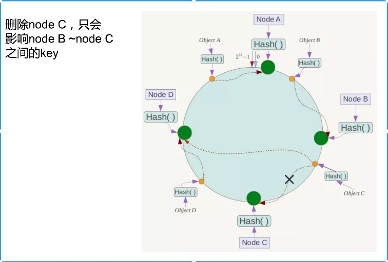
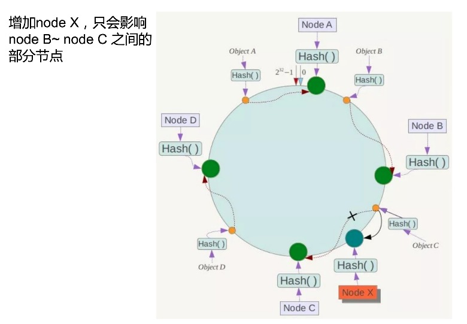
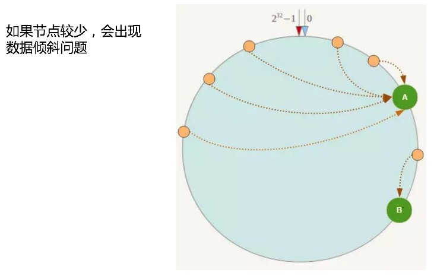
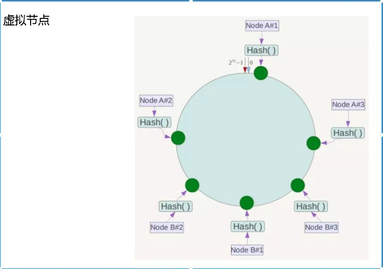

为什么开启这一篇呢？因为后面要对gopush进行讲解。

### 一致性哈希算法(图片网上资源，联系可删，描述均为自己观点)

>0~2^32-1 可以理解为一个圆的外环均匀分布为2^32个点 => key



>在圆上分布均匀分布4个节点(node)



>查找方式



>删除节点影响



>添加节点影响



>节点少的影响



>虚拟节点



### 哈希函数

定义:记录的存储位置 = f(关键字)

第一代：SHA-1(1993),MD5(1992),CRC(1975),Lookup3(2006)
第二代：MurmurHash(2008)
第三代：CityHash,SpookyHash(2011)

### 通过key获取comet-node节点

MurmurHash 是一种非加密型哈希函数，适用于一般的哈希检索操作。与其它流行的哈希函数相比，对于规律性较强的key，MurmurHash的随机分布特征表现更良好。

```
// init consistent hashing circle
func (k *Ketama) initCircle2(node []string) {
	h := NewMurmur3C()
	for _, str := range node {
		for i := 0; i < k.vnode; i++ {
			vnode := fmt.Sprintf("%s#%d", str, i)
			h.Write([]byte(vnode))
			vpos := uint(h.Sum32())
			k.nodes = append(k.nodes, vpos)
			k.nodesMapping[vpos] = str
			h.Reset()
		}
	}

	sort.Sort(UIntSlice(k.nodes))
}


```

###