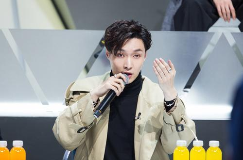

虽然，算不上饭圈。但近两年的火爆男女团选秀也是跟着浪潮看了几期。

最近，刷微博热搜，看到连淮伟参加了"青你3",初舞台获得C。普及一下，他在"青你1"获得第10名，然后前9名出道。换个说法，当年考985大学遗憾落榜但进入一所不错211大学的学长，在大学一年并没有荒废的情况下，心有不甘又回去准备高考了，结果第一场考试成绩只能上二本。
<!--more-->
现实生活中会不会有这样的事情，掉到二本极难，但再次落榜不无可能。因为变数太多了，而想争夺的位置太前了。而人生也是如此，没有高考的限定，但人生的考试难道就可以无限期拖延么？不能的，大学毕业后你才是个出入社会的菜鸟。当你刚站稳脚跟，准备展望一切的时候...

30岁的大门已经在向你挥手了，然后是35岁，40岁一个接一个严峻的课题。抛开那些自带bgm的人外，好像确实没有沾沾自喜的时间，无论你拿到了哪些成就，只要还处于平凡的阶段。即使你想拖住一切，但周围的环境会不断影响你。同化独特性好像是人们很喜欢的一件事情，除非这个独特性开始让人仰望，这时候人们才会膜拜。

现在的社会太浮躁了，谁都想一蹴而就。24岁毕业的大学生，初入社会摸爬滚打个3~4年开始立足，这或许才是常态，而众人却渴望他在这时候完成登顶。还是先拿到主角的剧本吧。

其实，我们能做的不过是一步一步的努力，当机遇出现时不顾一切的抓住它。即使可能失手，但至少不顾一切的体验过了。万一，成功了呢？

努力不代表成功，它只是增加成功的概率。那么，你希望有多大的概率成功呢？

